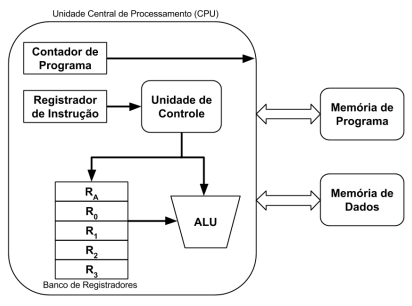

# Descrição Geral:
O computador pode ser visto como sendo um grande conjunto de componentes interligados, cada um com funções especializadas
e trabalhando de forma coordenada e sincronizada. Pode-se dizer que os principais componentes do  computador são a
unidade central de processamento (CPU), a memória e os periféricos. A CPU é a responsável pela execução das instruções e
pela coordenação das operações necessárias para executá-las. A memória é onde reside o conjunto de instruções a serem
executadas e os dados usados por tais instruções. Os periféricos interligam o mundo externo ao interior da máquina.

Estes componentes são formados por diversas unidades, cada uma das quais construídas por circuitos lógicos, combinacionais
e sequenciais.

# Objetivo:
Este trabalho tem o intuito de:
- Desmistificar o funcionamento interno dos computadores;
- Consolidar conceitos vistos durante o curso;
- Aumentar o interesse da turma por tópicos relacionados à organização interna de computadores, o que será tratado em
detalhes em outras disciplinas do curso.

Para tanto, o desafio é implementar uma arquitetura chamada aqui de MATA38-2021. Esta arquitetura foi especialmente
especificada para este trabalho e sua estrutura está representada na figura abaixo.

A arquitetura proposta é composta pela CPU e duas memórias: uma de programa e uma de dados. A CPU é composta pelo
**Contador de Programa (PC)**, **Registrador de Instrução (IR)**, **Unidade Lógica e Aritmética (ALU)**, **Banco de Registradores** e
**Unidade de Controle**. Um destes registradores, **RA**, é chamado de **acumulador**. Sua função é armazenar o resultado das
operações aritméticas da arquitetura proposta. Os demais registradores, **R0**, **R1**, **R2** e **R3**, são de propósito geral.

A **Memória de Programa (ROM)** armazena as instruções que serão executadas pelo computador e a **Memória de Dados (RAM)**
armazena os dados manipulados pelas instruções. A Memória de Programa possui 5 bits de endereçamento e a Memória de
Dados possui 2 bits de endereço. Todas as memórias podem armazenar um byte de informação, em cada endereço.

Lembre-se que memórias são dispositivos passivos e, portanto, não endereçam, nem controlam outros dispositivos.

A **ALU** é a unidade responsável pela execução das operações lógicas e aritméticas. Tal componente pode ser visto como
vários circuitos combinacionais operando em paralelo, cada um responsável por uma determinada operação.

A **Unidade de Controle (UC)** gera os sinais de controle responsáveis por garantir o correto funcionamento do computador.

O **PC** e o **IR** são registradores de controle e estado. O PC é responsável por garantir a busca sequencial das instruções.
Após a busca de uma instrução, o PC é incrementado. O IR é responsável por armazenar a instrução que está sendo executada
no momento.

A implementação da arquitetura MATA38-2021 deve garantir a correta comunicação entre todos os componentes. Todas as
instruções contidas na Memória de Programa devem ser executadas e o resultado disto deve ser escrito na Memória de Dados.
O funcionamento do circuito será testado através da execução de um programa que será armazenado na Memória de Programa,
com os respectivos dados na Memória de Dados.

A implementação solicitada neste trabalho deverá ser realizada na plataforma: Logisim (http://www.cburch.com/logisim/).
Estas ferramentas já oferecem diversas funcionalidades e circuitos integrados já prontos, o que facilita o projeto e a
depuração aqui descritos. Ao final do trabalho, a arquitetura MATA38-2021 deve ser capaz de executar um pequeno programa 
codificado a partir de um conjunto de instruções.

# Conjunto de Instruções:

A arquitetura MATA38-2021 só lida com instruções aritméticas e de movimentação de dados e de controle. Os operandos das
instruções aritméticas são armazenados em registradores. Geralmente, o valor de saída da operação realizada pela **ALU** é
armazenado em um registrador, comumente chamado de **acumulador**. O acumulador é identificado como RA.

As instruções de movimentação de dados são responsáveis por carregar dados da memória de dados para o registradores,
armazenar o dado do acumulador na memória de dados e, também, mover o dado de um registrador de propósito geral para
outro. Essas operações garantem que os operandos das operações aritméticas sejam carregados nos respectivos registradores.

O formato de uma instrução é geralmente dividido em três campos: um para o identificador da instrução e dois para os
operandos. O identificador da instrução é um código de 4 bits após os quais seguem mais quatro bits para identificação
dos registradores que contém os operandos. Desta forma, esta máquina pode conter no máximo 16 instruções (ver **Tabela 1**).

São apenas quatro registradores endereçáveis, **R0**, **R1**, **R2** e **R3**. Todos os resultados das operações são colocados no
acumulador, **RA**, como pode ser observado na **Tabela 1**.

Note que a palavra da MATA38-2021 possui 8 bits (1 byte de palavra). As instruções podem ser de dois tipos, com os
seguintes formatos:

- **Tipo I:** Estas são instruções que possuem dois operandos de dois bits, cada um dos quais endereça um registrador e tem
formato INST Rx, Ry.
- **Tipo II:** A única instrução do tipo dois é a **HLT**, que não possui parâmetros e, portanto, tem seus quatro bits menos significativos ignorados pelo processador. Sua função é encerrar o fluxo de controle. Todo programa contém esta instrução como a última instrução a ser executada.

Atentar que deverá implementar também um decodificador de instruções, responsável por analisar e executar cada instrução
(não representado na primeira figura deste documento).

**Tabela 1:** Conjunto de instruções da máquina MATA38-SLS. Na tabela duas notações especiais foram usadas. O operador **[Rx]**
ou **[Ry]** significa o conteúdo contido no endereço do registrador **x** ou **y**.

| Operação                     | Mnemônico     | Código (em hexadecimal) | Descrição             |
| ---------------------------- | ------------- | ----------------------- | --------------------- |
| Multiplicação                | MUL Rx, Ry    | 0x8                     | [RA] ← [Rx] * [Ry]    |
| Adição                       | ADD Rx , Ry   | 0x9                     | [RA] ← [Rx] + [Ry]    |
| Encerrar fluxo de programa   | HLT           | 0xA                     |                       |
| Copiar registrador           | MOV Rx , Ry   | 0xB                     | [Rx] ← [Ry]           |
| Copiar acumulador            | MOV Rx , RA   | 0xC                     | [Rx] ← [RA]           |
| Ler da memória de dados      | RDM Rx , End. | 0xD                     | [Rx] ← End. mem dados |
| Armazena na memória de dados | STR End., Rx  | 0xE                     | End. mem dados ← [Rx] |
